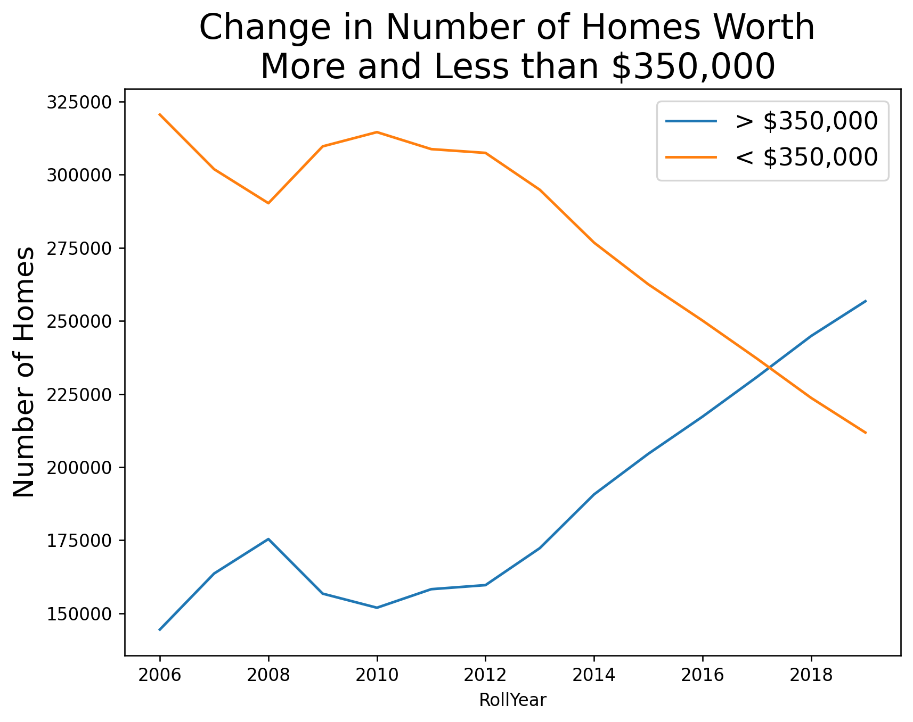
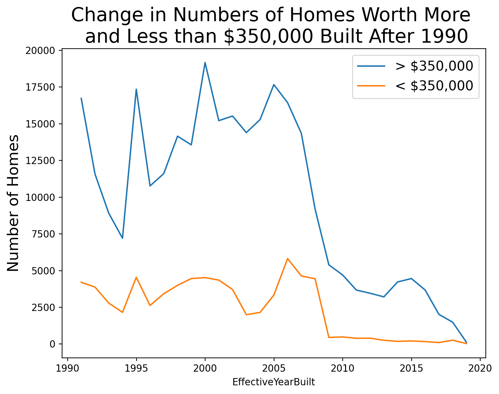

# Data Scientist Analysis Exercise, July 2020
## Mayor Garcetti's Innovation Team
### Author: Hovanes Gasparian
#### Exercise Option 4: County Assessor Parcel Dataset

---

#### Questions for Parcel within the City of Los Angeles

1. How many parcels are in the City of Los Angeles?
    * 824,132
2. How many single-family parcels are there in the City of Los Angeles?
    * 481,650
3. What is the average square footage for different types of parcels?

| Property Type  | Square Footage |
|:---------------|-----------:|
| N/A            |  3609.58   |
| Commercial/Industrial | 12358.52    |
| Condominium    |  1311.74   |
| Other          |  6144.49   |
| Residential-Income |  5871.66   |
| Single Family Residence |  1812.35   |
| Vacant         |    85.82   |

   * Does this vary by region within the city?
     * Yes, it most certainly does. If we look at the average breakdown by just zipcode, the range is quite drastic. If we just focus on Single Family Residences, the range is still very significant. The median zipcode has an average square footage of 1719, but some zip codes have average square footages that are over 10 times as much. The average total values for single family homes in Los Angeles have grown over time, almost doubling over the past 15 years.

4.  How has housing changed over time in the City of Los Angeles?

   * While the average value of homes in Los Angeles has increased dramatically over the past 15 years in Los Angeles. The number of affordable homes has dropped. Sure, a part of the explanation for the trends seen above are that existing homes have simply risen in value. However, as we will see below, this trend holds even for newly built homes. 

5. What (if anything) does this dataset tell you about opportunities to build more affordable housing?

   * As we can see from the plot above, the number of homes built after the 2008/2009 housing/economic crisis plummeted. However, there was a recovery in higher priced homes in 2013, whereas lower priced homes flatlined and have stayed that way. There is a dire need for more affordable homes, not just affordable housing, the vast majority of which is provided through rental assistance for apartments (i.e. income-based apartments, Section 8, etc.). Homeownership is still one of the primary drivers of upward mobility, yet it is increasingly hard to come by.

6.  Based on your analysis, please share any changes to services, programs, or policies that the City should consider.
    * The City of Los Angeles has 2 programs for assisting first-time homebuyers: Low Income Purchase Assistance (LIPA) and Mortgage Credit Certificate (MCC). The LIPA is broken down into two parts: one for low income homebuyers and one for moderate income homebuyers. Unfortunately, the [latter part](https://hcidla2.lacity.org/help-moderate-income-first-home-buyers) is _currently out of funds_. The City should consider refunding this program. As for the MCC, the City should consider increasing the tax credit amount, especially since the Tax Credits and Jobs Act (TCJA) that was passed by Congress lowered the amount of mortgage interest that could be deducted. 